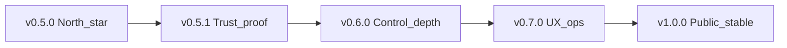

# Unstick — future roadmap (after v0.5.0)

**Current Latest:** [v0.7.0](RELEASE-v0.7.0.md) (unsigned portable)  
**North-star:** [hardware-control-north-star.md](../specs/backend/hardware-control-north-star.md)  
**Living index:** [roadmap-next-release.md](roadmap-next-release.md)

```
HANDOFF ATOMIC STEP: none — forward after 0.7.0; next Authenticode or v1.0 gates
PAUSED / CANCELLED:    Suspend-as-primary; overclocking; standby purge; DPC “fixes”; other-OS; damage claims; zero-stutter claims
CANONICAL OWNER:       docs + product direction
PROOF BEFORE DONE:     Each version names L1–L3 proof before “shipped”
```

## Guiding principle

Improve **along the hardware-control spine** (sense → envelope → soft control → restore), not by becoming a general PC optimizer.

Every candidate feature must answer:

1. Does it reduce **OS-disk / RAM freeze risk** or **thermal-power load** on mid-range Windows?
2. Is the lever **documented** (MS Learn / OS APIs) and **restorable** (TTL / leave-plan)?
3. Can we **prove** it (L1 unit + L3 soak) without claiming damage prevention or FPS boost?

If no → defer or reject (see north-star lever matrix).



---

## v0.5.1 — Trust & proof (near-term)

**Goal:** Make unsigned Latest safer to recommend; deepen evidence, not surface area.

| Work | Why |
|------|-----|
| Authenticode signing when cert available | SmartScreen; public “Latest” honesty |
| Long L3 soak on real boot SSD/HDD + cliff `disk_hog` | Prove capping → fluidity, not only tripwires |
| Self-overhead measurement pass | Guard must not be the freeze |
| Setpoint / stress-shift tuning from soak notes | Data-driven, not gut |
| Repo polish | Description/topics; release notes hygiene |

**Out:** new actuators; MSI; Idle Efficiency Mode (unless soak proves Soft max-2 insufficient).

---

## v0.6.0 — Control depth (mission actuators)

**Detail:** [roadmap-v0.6.0.md](roadmap-v0.6.0.md) · **Design:** [idle-under-stress-design.md](../specs/backend/idle-under-stress-design.md)

**Goal:** Stronger soft demotion **only where north-star allows deepen**.

| Candidate | Gate | Status |
|-----------|------|--------|
| Task Manager–parity Efficiency Mode (EcoQoS + Idle) under **sustained** stress streak + soft TTL | Design + hang FP soak | **Shipped in 0.6.0** — L3 Run 2 i3 + restore |
| PI-ish / smoother intensity | Must not reintroduce cliff parking | Later |
| Richer offender ranking | Focus/whitelist sacred | Later |
| Dual-axis soak recipe | Proof harness | Optional with I4 |

**Still reject:** timer-resolution IGNORE, standby purge, RAM “cleaners”, GPU clocks.

---

## v0.7.0 — UX & ops (operator clarity)

**Detail:** [roadmap-v0.7.0.md](roadmap-v0.7.0.md)

**Goal:** Users understand *what Guard did* and can run it as a daily tool.

| Work | Why |
|------|-----|
| Session “actions taken” summary (capped / restored counts) | Trust after EMERGENCY |
| Profiles: Gaming / Dev / Quiet (whitelist + aggressiveness presets) | Same engine, different policy skins |
| Tray: pressure + capping badge without opening UI | Always-on without clutter |
| Optional in-app “prove control” that launches cliff fixture | Lowers soak friction |
| Config export/import | Support / multi-machine |

**Avoid:** dashboard sprawl; fake health scores; marketing tiles in the hero.

---

## v1.0.0 — Public stable (definition of done)

Ship **v1.0** only when all are true:

1. **Signed** portable Latest (Authenticode)  
2. Documented L3 soak evidence on ≥1 slow OS drive + ≥1 mid-range gaming/dev machine  
3. Soft-only path has **no known indefinite demotion** hangs (TTL + restore proven)  
4. Claims frozen: freeze mitigation + load/thermal relief — still **not** damage prevention  
5. Install story clear: zip + HKCU autostart (MSI optional, not required for 1.0)

MSI/MSIX and Store are **nice-to-have**, not the 1.0 gate.

---

## Explicitly never (unless mission rewrite)

| Idea | Why not |
|------|---------|
| Overclock / GPU boost / “Smart Booster” | Wrong product |
| Kernel DPC “fix” | User-mode cannot; advisory only |
| Cross-OS installers | Scope lock Windows x64 |
| Standby list purge / fake free RAM | Harmful folklore |
| Suspend as default | Hang risk; Soft path is the product |

---

## How to choose the next atomic step

Prefer the **smallest** item that raises either:

- **Trust** (sign, soak proof, overhead), or  
- **Control quality** (better soft demotion under real freeze cliffs), or  
- **Operator clarity** (sensing vs capping already done — next is action history / profiles)

Default next after 0.7.0: **Authenticode** when a cert exists, then **v1.0** gates (signed Latest + multi-machine soak + frozen claims); do not claim zero launch stutter.
