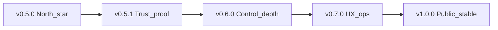

# Unstick — next release roadmap

**Shipped Latest:** **`v0.6.0`** ([notes](RELEASE-v0.6.0.md), unsigned zip) — Idle-under-stress Efficiency Mode  
**Forward plan:** **[roadmap-future.md](roadmap-future.md)** (0.7 → 1.0; Authenticode parallel)  
**Product scope:** Windows-only OS-disk / RAM / thermal-power **hardware control** — freeze mitigation + load/thermal **relief**, not a general performance suite.  
**Design:** [idle-under-stress-design.md](../specs/backend/idle-under-stress-design.md) · [hardware-control-north-star.md](../specs/backend/hardware-control-north-star.md)

---

## Next: v0.7.0 — UX & ops

**Detail:** [roadmap-future.md](roadmap-future.md) § v0.7.0

| Work | Status |
|------|--------|
| Session actions summary | Pending |
| Gaming / Dev / Quiet profiles | Pending |
| Tray pressure + capping badge | Pending |
| Authenticode when cert | Blocker — [signing-blocker.md](signing-blocker.md) |

---

## Shipped

| Version | Notes |
|---------|--------|
| **0.6.0** | [RELEASE](RELEASE-v0.6.0.md) · [roadmap](roadmap-v0.6.0.md) — Efficiency Idle i3; L3 Run 2 |
| **0.5.1** | [roadmap](roadmap-v0.5.1.md) — soak evidence + signing blocker (trust band) |
| **0.5.0** | [RELEASE](RELEASE-v0.5.0.md) — hardware-control north-star |

---

## Explicitly out (all versions)

- Standby purge; kernel DPC “fixes”; other-OS installers  
- Claiming hardware-damage prevention (overload = **relief** only)  
- Overclocking / GPU boost / general PC-optimizer suite  
- Suspend as default product path  

---

## Older

- [v0.4.0](RELEASE-v0.4.0.md) · [v0.3.0](RELEASE-v0.3.0.md)
