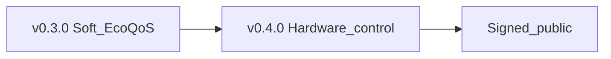

# Unstick — next release roadmap

**Shipped:** `v0.1.0` … `v0.3.0`, **`v0.4.0`** (hardware control D0–D5; unsigned)  
**Product scope:** Windows-only disk/RAM hardware control — **not** a general performance suite.  
**Design:** [hardware-control-redesign.md](../specs/backend/hardware-control-redesign.md)  
**Notes:** [RELEASE-v0.4.0.md](RELEASE-v0.4.0.md)

---

## v0.4.0 launch (Option 2)

| Phase | Work | Status |
|-------|------|--------|
| D0–D5 | Design → Soft-only → envelope → disk/mem loops → UI framing | **Done** (shipped in 0.4.0) |

### After v0.4.0

- [ ] Obtain Authenticode cert → `Package-Portable.ps1 -Sign` → promote signed Latest  
- [ ] Optional setpoint / self-overhead tuning  
- [ ] Optional Windows MSI/MSIX  

### Explicitly out

- Standby purge; kernel DPC “fixes”; other-OS installers  
- Claiming hardware-damage prevention  
- General PC-optimizer suite  

---

## v0.3.0

See [RELEASE-v0.3.0.md](RELEASE-v0.3.0.md).
