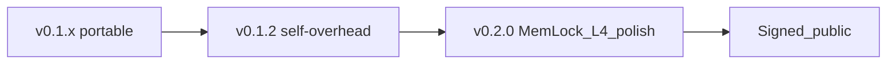

# Unstick — next release roadmap

**Shipped:** `v0.1.0` … `v0.1.2`, **`v0.2.0`** (Mem Lock L4 + portable polish; unsigned until cert)  
**Next tag:** `v0.2.1` / `v0.3.0` — Authenticode public Latest; optional Darwin apply; MSI if needed  
**Notes:** [RELEASE-v0.2.0.md](RELEASE-v0.2.0.md) · **Packaging:** [v0.2-packaging-design.md](../specs/backend/v0.2-packaging-design.md)

---

## v0.2.0 launch definition

| # | Gate | Status |
|---|------|--------|
| V2-1 | Mem Lock L4 FP | **PASS** |
| V2-2 | Portable update story | **Done** |
| V2-3 | Code signing for public | **Scaffolding**; cert pending — release is unsigned private beta |
| V2-4 | USER-GUIDE Mem Lock + events | **Done** |
| V2-5 | Darwin QoS apply | Stubs + `supported()`; live apply needs macOS host |

### Work breakdown

| ID | Work | Status |
|----|------|--------|
| M1 | Mem Lock L4 | **Done** |
| M2 | MsMpEng / elevated noise | **Done** |
| M3 | Signed portable path | Design + `-Sign`; cert pending |
| M4 | Tray HARD toast | **Done** |
| M5 | Event viewer | **Done** |
| M6 | Darwin live apply | Deferred (stubs OK on Windows CI) |
| M7 | Docs / release notes | **Done** |

---

## After v0.2.0

- [ ] Obtain Authenticode cert → `Package-Portable.ps1 -Sign` → promote signed Latest  
- [ ] Darwin QoS/App Nap apply smoke on macOS  
- [ ] Optional MSI/MSIX  
- [ ] Event viewer polish / filter chips if needed  
