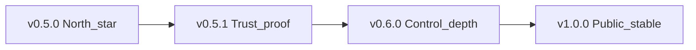

# Unstick — next release roadmap

**Shipped Latest:** **`v0.5.0`** ([notes](RELEASE-v0.5.0.md), unsigned zip) — hardware-control north-star  
**Forward plan:** **[roadmap-future.md](roadmap-future.md)** (0.5.1 → 0.6 → 0.7 → 1.0)  
**Product scope:** Windows-only OS-disk / RAM / thermal-power **hardware control** — freeze mitigation + load/thermal **relief**, not a general performance suite.  
**Design:** [hardware-control-north-star.md](../specs/backend/hardware-control-north-star.md) · [hardware-control-redesign.md](../specs/backend/hardware-control-redesign.md)

---

## Next: v0.5.1 — Trust & proof

**Detail:** [roadmap-v0.5.1.md](roadmap-v0.5.1.md)

| Work | Status |
|------|--------|
| T1 Band roadmap | **Done** |
| T2 L3 cliff soak evidence | Template ready — fill on soak machine |
| T3 Repo description/topics | **Done** |
| T4 Self-overhead remeasure (0.5.0) | **Done** (~1.5% one-core idle) |
| T5 Authenticode or signing blocker doc | **Blocker documented** ([signing-blocker.md](signing-blocker.md)) |

Forward ladder: [roadmap-future.md](roadmap-future.md)  

---

## Later bands (summary)

| Version | Theme |
|---------|--------|
| **0.6.0** | Control depth — Idle-under-stress Efficiency Mode (design-gated); smoother intensity; better offender ranking |
| **0.7.0** | UX/ops — action history; Gaming/Dev profiles; tray badges |
| **1.0.0** | Public stable — signed + soak evidence + hang-free Soft path; claims frozen |

Full ladder + anti-goals: [roadmap-future.md](roadmap-future.md)

---

## v0.5.0 — Hardware-control north-star (**shipped**)

**Detail:** [roadmap-v0.5.0.md](roadmap-v0.5.0.md) · **Notes:** [RELEASE-v0.5.0.md](RELEASE-v0.5.0.md)

P0–P2 + S1–S4 **Done**. Unsigned portable = current Latest until Authenticode.

---

## Explicitly out (all versions)

- Standby purge; kernel DPC “fixes”; other-OS installers  
- Claiming hardware-damage prevention (overload = **relief** only)  
- Overclocking / GPU boost / general PC-optimizer suite  
- Suspend as default product path  

---

## Older

- [v0.4.0](RELEASE-v0.4.0.md) · [v0.3.0](RELEASE-v0.3.0.md)
