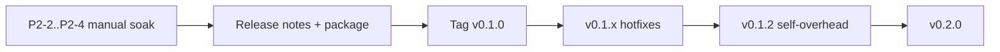

# Unstick — next release roadmap

**Shipped:** `v0.1.0`, `v0.1.1`, `v0.1.2` (self-overhead)  
**Next tag:** `v0.2.0` (Mem Lock L4 + installer + signing)  
**Canonical v0.1 detail:** [roadmap-v0.1.md](roadmap-v0.1.md) · **Proof checklist:** [p2-proof-checklist.md](p2-proof-checklist.md) · **v0.1.2 notes:** [RELEASE-v0.1.2.md](RELEASE-v0.1.2.md)

---

## 1. Shipped: `v0.1.0` / `v0.1.1`

v0.1.0 launch gates G1–G7 and P2 soaks are **done** (see [RELEASE-v0.1.0.md](RELEASE-v0.1.0.md), [RELEASE-v0.1.1.md](RELEASE-v0.1.1.md)).

---

## 1b. Patch: `v0.1.2` (self-overhead)

### Goal

Lower Unstick’s own CPU/I/O (sampling strings, `status.json`, UI paint) on low-end PCs. **No** SoftOnly / Disk / Mem Lock policy retune.

### Launch definition

| # | Gate | Status |
|---|------|--------|
| O1 | Specs: investigation + design | **Done** — `specs/backend/self-overhead-*.md` |
| O2 | Gated cmdline (+ warm path) in `WinSensor::sample` | **Done** |
| O3 | Compact + ≤1 Hz `status.json` on Normal; IPC fresh | **Done** |
| O4 | Adaptive UI repaint (~1 Hz settled / ~15 Hz lerp) | **Done** |
| O5 | L3 `Measure-SelfOverhead.ps1` before/after | **Done** — [self-overhead-l3-evidence.md](../specs/backend/self-overhead-l3-evidence.md) |
| O6 | L2 `Verify-P2-Automated.ps1` + portable zip + notes | Ship checklist |

### Out of `v0.1.2`

| Item | Defer to |
|------|----------|
| ≤0.5% one-core absolute idle (lighter process enum) | later patch / research |
| Mem Lock L4, MSI, code signing | **v0.2.0** |

---

## 2. Following release: `v0.2.0`

### Goal

Promote **Mem Lock** and packaging maturity; start cross-platform apply surface without abandoning Windows as the primary SKU.

### v0.2 launch definition

| # | Gate | Notes |
|---|------|-------|
| V2-1 | Mem Lock L4 false-positive (mapped I/O / IDE) — no Hard latch | **PASS** 2026-07-17 — [mem-lock-l4-evidence.md](../specs/backend/mem-lock-l4-evidence.md) |
| V2-2 | Installer path (MSI or MSIX) **or** signed portable + documented update story | Design locked: portable zip — [v0.2-packaging-design.md](../specs/backend/v0.2-packaging-design.md) |
| V2-3 | Code signing required for public download | Non-negotiable for “public” (cert pending) |
| V2-4 | Release notes + USER-GUIDE Mem Lock section validated on soak | Already drafted |
| V2-5 | Optional: Darwin `guardian-mac` real QoS/App Nap apply behind `supported()` | Stubs exist |

### v0.2 work breakdown

| ID | Work | Depends on | Proof |
|----|------|------------|-------|
| M1 | Mem Lock L4 soak checklist + sign-off | v0.1.2 tagged | Manual matrix |
| M2 | Soften MsMpEng / elevated apply noise (status copy or skip list) | Soak feedback | Fewer false amber warnings |
| M3 | MSI/MSIX **or** signed update channel | Signing cert | Clean install/uninstall |
| M4 | P3-1 Tray balloon on Disk/Mem Lock HARD | — | Manual |
| M5 | P3-2 Event viewer (last N from `events.jsonl`) | — | UI + L1 |
| M6 | `guardian-mac` pthread/GCD QoS + Nap cooperate (no Suspend analogue) | macOS build host | L1 + smoke on Darwin |
| M7 | Docs: v0.2 USER-GUIDE + changelog | M1–M3 | Peer read |

### Out of v0.2 (later)

- Linux PSI live apply / cgroup memory.high  
- Multi-volume Disk Lock  
- Standby purge  
- Store listing polish  
- Sub-0.5% guardian idle via partial process sampling  

---

## 3. Decision log (next-release)

| Decision | Choice |
|----------|--------|
| v0.1.2 | Self-overhead (gated strings, status I/O, UI paint) before packaging |
| Mem Lock in v0.1 | **Yes in binary + docs**; L4 marketing bar → v0.2 |
| Public download | Prefer signed; unsigned = private beta only |
| Next major after 0.1.x | **`v0.2.0`** installer + Mem Lock L4 + optional Darwin apply |

---

## 4. One-page checklist (print / sticky)

**Before `v0.1.2`:**

- [x] Self-overhead investigation + design  
- [x] Implement + L3 measure evidence  
- [x] L2 `Verify-P2-Automated.ps1`  
- [x] Package + [RELEASE-v0.1.2.md](RELEASE-v0.1.2.md) + tag  

**Before `v0.2.0`:**

- [x] Mem Lock L4 FP signed ([mem-lock-l4-evidence.md](../specs/backend/mem-lock-l4-evidence.md))  
- [ ] Installer or signed update path ([v0.2-packaging-design.md](../specs/backend/v0.2-packaging-design.md) locked: portable zip)  
- [ ] Code signing for public assets  
- [ ] Optional Darwin QoS apply smoke  
- [ ] Tag `v0.2.0`
