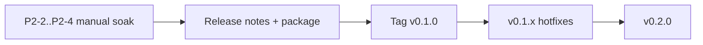

# Unstick — next release roadmap

**Next tag:** `v0.1.0` (portable Windows beta)  
**Then:** `v0.2.0` (Mem Lock as a marketed pillar + installer)  
**Canonical v0.1 detail:** [roadmap-v0.1.md](roadmap-v0.1.md) · **Proof checklist:** [p2-proof-checklist.md](p2-proof-checklist.md)

---

## 1. Next release: `v0.1.0`

### Goal

Ship a **safe-by-default portable Guard** for low-end Windows PCs: Disk Lock + SoftOnly Critical Guard, crash-safe suspend recovery, honest limits. Non-developers can install via zip + optional autostart.

### Launch definition (must all be true)

| # | Gate | Status |
|---|------|--------|
| G1 | P0 safety (ledger resume, max-suspend, SoftOnly default, elevation honesty) | **Done** |
| G2 | P1 ops (package, autostart, log, version, USER-GUIDE) | **Done** |
| G3 | P2-1 automated (`Verify-P2-Automated.ps1` / CI) | **Done** (confirm green CI on push) |
| G4 | **P2-2** Disk Lock L3 soak on target SSD | **Probe PASS 2026-07-17** — TM ±15% human-confirm optional |
| G5 | **P2-3** L4 decoy / whitelist never suspended | **PASS 2026-07-17** |
| G6 | **P2-4** ≥2h false-positive (coding + gaming) | **Blocking — unsigned** |
| G7 | Portable zip + filled release notes | **Ready** — `Unstick-0.1.0-windows-x64.zip` + [RELEASE-v0.1.0.md](RELEASE-v0.1.0.md) |

**Do not tag `v0.1.0` until G4–G6 are dated in [p2-proof-checklist.md](p2-proof-checklist.md).**

### Work remaining before launch (ordered)

| Priority | Work | Owner | Proof |
|----------|------|-------|-------|
| **Blocker** | Sign off P2-2 Disk Lock L3 ([critical-guard-soak.md](critical-guard-soak.md) § L3b) | Maintainer / soak machine | Checklist dated |
| **Blocker** | Sign off P2-3 fake-miner L4 + Explorer/Cursor/whitelist safety | Maintainer | Checklist dated |
| **Blocker** | Sign off P2-4 2h FP pass | Maintainer | Checklist dated |
| **Blocker** | Fix any bugs found in G4–G6 (hotfixes land in tree before tag) | Eng | Re-soak failed claim only |
| Ship | `Package-Portable.ps1` + GitHub Release asset | Eng | Zip boots service + UI |
| Ship | Release notes (limits, SoftOnly default, elevation) | Docs | Notes in tag body |
| Strongly recommended | Code signing (P3-3) — can slip to private beta unsigned | Ops | Signed binaries or explicit “unsigned beta” banner |

### Already in tree (counts for v0.1 notes)

Do **not** treat these as launch blockers; they are already implemented and should be described honestly in notes:

- Focus-aware progressive scheduling + SoftOnly / Last-resort modes  
- Disk latency tripwire, hard-fault cause split, DPC/ISR advisory  
- PSI-shaped stall fractions, thermal/power axis (Suspend suppress when Serious)  
- Portable QoS / Nap labels + `guardian-mac` stubs  
- **Mem Lock** (RSS trim) + Guard sliders + L3 probe **PASS** (`Verify-MemLock-L3.ps1`)

### Mem Lock policy for `v0.1.0`

| Choice | Rationale |
|--------|-----------|
| **Include in v0.1 binaries and USER-GUIDE** | Already shipping in the build; hiding it from notes is dishonest |
| **Market lightly** (“RAM soft/hard available %”) | Full Mem Lock L4 false-positive matrix stays a **v0.2** quality bar |
| SoftOnly remains default | Mem Lock Hard never Suspends unless user chooses Last-resort |

Update release-notes skeleton accordingly (remove “Mem Lock not included”).

### Explicitly still out of `v0.1.0`

| Item | Defer to |
|------|----------|
| MSI / MSIX / Store | v0.2 |
| Windows SCM service | later |
| Kernel / minifilter IOPS | never (user-mode product) |
| Standby-list purge | later opt-in only |
| Multi-volume Disk Lock | later |
| Live Darwin QoS apply / macOS app | v0.2+ |
| Tray balloon / in-UI event viewer (P3-1/2) | v0.1.x optional |

### Suggested v0.1 calendar (agnostic)

1. Complete G4 → G5 → G6 on the WD Green (or equivalent) soak machine  
2. Package + notes → **tag `v0.1.0`**  
3. Open `v0.1.1` only for soak regressions  

---

## 2. Following release: `v0.2.0`

### Goal

Promote **Mem Lock** and packaging maturity; start cross-platform apply surface without abandoning Windows as the primary SKU.

### v0.2 launch definition

| # | Gate | Notes |
|---|------|-------|
| V2-1 | Mem Lock L4 false-positive (mapped I/O / IDE) — no Hard latch | Complements existing L3 probe |
| V2-2 | Installer path (MSI or MSIX) **or** signed portable + documented update story | Pick one primary |
| V2-3 | Code signing required for public download | Non-negotiable for “public” |
| V2-4 | Release notes + USER-GUIDE Mem Lock section validated on soak | Already drafted |
| V2-5 | Optional: Darwin `guardian-mac` real QoS/App Nap apply behind `supported()` | Stubs exist |

### v0.2 work breakdown

| ID | Work | Depends on | Proof |
|----|------|------------|-------|
| M1 | Mem Lock L4 soak checklist + sign-off | v0.1 tagged | Manual matrix |
| M2 | Soften MsMpEng / elevated apply noise (status copy or skip list) | Soak feedback | Fewer false amber warnings |
| M3 | MSI/MSIX **or** signed update channel | Signing cert | Clean install/uninstall |
| M4 | P3-1 Tray balloon on Disk/Mem Lock HARD | — | Manual |
| M5 | P3-2 Event viewer (last N from `events.jsonl`) | — | UI + L1 |
| M6 | `guardian-mac` pthread/GCD QoS + Nap cooperate (no Suspend analogue) | macOS build host | L1 + smoke on Darwin |
| M7 | Docs: v0.2 USER-GUIDE + changelog | M1–M3 | Peer read |

### Out of v0.2 (later)

- Linux PSI live apply / cgroup memory.high  
- Multi-volume Disk Lock  
- Standby purge  
- Store listing polish  

---

## 3. Decision log (next-release)

| Decision | Choice |
|----------|--------|
| Immediate tag | **`v0.1.0`** after P2-2..P2-4 only |
| Mem Lock in v0.1 | **Yes in binary + docs**; L4 marketing bar → v0.2 |
| Public download | Prefer signed; unsigned = private beta only |
| Next major after 0.1 | **`v0.2.0`** installer + Mem Lock L4 + optional Darwin apply |

---

## 4. One-page checklist (print / sticky)

**Before `v0.1.0`:**

- [x] P2-2 Disk Lock L3 signed (probe 2026-07-17; optional TM eyeball on soak SSD)  
- [x] P2-3 L4 decoy signed (2026-07-17)  
- [ ] P2-4 2h FP signed  
- [ ] CI green on default branch  
- [x] Package-Portable zip smoke (`Unstick-0.1.0-windows-x64.zip`)  
- [x] Release notes draft ([RELEASE-v0.1.0.md](RELEASE-v0.1.0.md))  
- [ ] Commit release tree + tag `v0.1.0` (after P2-4)

**Before `v0.2.0`:**

- [ ] Mem Lock L4 FP signed  
- [ ] Installer or signed update path  
- [ ] Code signing for public assets  
- [ ] Optional Darwin QoS apply smoke  
- [ ] Tag `v0.2.0`
