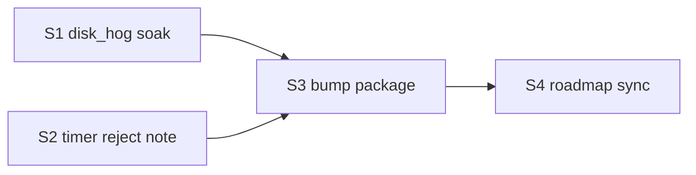

# Unstick — v0.5.0 roadmap

**Status:** **Shipped** (unsigned portable) — ship gates S1–S4 complete  
**Theme:** Hardware-control north-star — freeze mitigation + load/thermal **relief**  
**Design:** [hardware-control-north-star.md](../specs/backend/hardware-control-north-star.md) · [freeze-safe-dynamic-control-design.md](../specs/backend/freeze-safe-dynamic-control-design.md)  
**Notes:** [RELEASE-v0.5.0.md](RELEASE-v0.5.0.md) · zip `Unstick-0.5.0-windows-x64.zip`  
**Prior:** [RELEASE-v0.4.0.md](RELEASE-v0.4.0.md) (closed-loop D0–D5)

```
HANDOFF ATOMIC STEP: v0.5.0 — S4 closeout complete; optional git tag / GitHub upload next
PAUSED / CANCELLED:    Suspend-as-primary; overclocking; standby purge; kernel DPC fixes; other-OS; damage claims
CANONICAL OWNER:       docs + guardian-core/control + guardian-ui Guard + fixtures
PROOF BEFORE DONE:     L1 tests; L3 soak note; portable zip; RELEASE-v0.5.0.md — met
```

## Why 0.5.0

v0.4.0 parked utilization near the freeze cliff and framed Hardware Guard. Soak feedback showed:

1. Brief 100% spikes ≠ freezes — need headroom + fast release + soft TTL  
2. EMERGENCY without capping looked like failure — need sensing vs capping UX  
3. Console windows hurt trust — GUI subsystem  
4. Product direction: targeted fluidity + freeze mitigation + overload **relief** (not damage prevention / game boosters)

v0.5.0 packages that north-star into a coherent release.

## Already in tree (changelog for 0.5.0)

| Area | Work | Proof |
|------|------|-------|
| Freeze-safe band | `U_SET` 0.80–0.88; fast release; intensity max 2 | L1 `control::` |
| Soft TTL | `max_soft_demote_secs` (45) force restore | L1 `guardian-win` |
| Stress headroom | Latency / Disk Hard / paging / **thermal-power** → −0.12 band | L1 thermal tests |
| UX | Tripwire · monitoring vs soft capping; Event log **capped** | Manual Guard |
| Clean runtime | `windows_subsystem`; file-only service logs; `pnpm dev` kills prior EXEs | PE subsystem=2 |
| Docs | North-star, USER-GUIDE claims, roadmap, soak thermal note | Spec review |

## Ship gates

| ID | Work | Owner | Done when |
|----|------|-------|-----------|
| **S1** | Stronger `disk_hog` defaults (larger/longer CLI args documented) for freeze-cliff soak — not a product feature | `fixtures/disk_hog` + soak docs | **Done** — default 1024 MiB/180s; `cliff` = 2048 MiB/300s; soak § L3b updated |
| **S2** | Timer-resolution / multimedia power flag — **investigation → reject** with short evidence note | `specs/backend/timer-resolution-reject.md` | **Done** — Reject; no product code path |
| **S3** | Version bump workspace `0.5.0` + `docs/RELEASE-v0.5.0.md` + package zip | `Cargo.toml` / Package-Portable | **Done** — `Unstick-0.5.0-windows-x64.zip` |
| **S4** | Mark P0–P2 **Done** on next-release roadmap; point Latest intent at unsigned 0.5.0 | `docs/roadmap-next-release.md` | **Done** — shipped status + unsigned Latest intent |

## Explicitly deferred (post-0.5.0)

| Item | Why later |
|------|-----------|
| Efficiency Mode Idle under stress streak (P3 actuator) | Needs dedicated design + hang risk; Soft TTL alone may suffice |
| Authenticode signed Latest | Cert dependency |
| MSI/MSIX | Packaging track |
| Self-overhead / setpoint fine-tune from long L3 | Needs soak machine evidence |
| Timer-resolution **adopt** | **Rejected** in S2 ([timer-resolution-reject.md](../specs/backend/timer-resolution-reject.md)) |

## Out of release (unchanged anti-goals)

- Overclocking / GPU boost / “Smart Booster”  
- Hardware-damage prevention claims  
- Standby purge / fake RAM cleaner  
- Cross-OS installers  
- Suspend as default product path  

## Suggested execution order



1. **S1 + S2** in parallel (fixtures + reject spec)  
2. **S3** version + RELEASE + `Package-Portable.ps1`  
3. **S4** roadmap closeout  
4. Tag `v0.5.0` + GitHub release (zip upload when network allows)

## Claim line for RELEASE notes

> Unstick 0.5.0 — freeze mitigation and load/thermal relief for the OS drive and RAM. Soft background capping with real headroom; sensing vs capping made visible. Not a game booster and not hardware-damage insurance.

## Success criteria

- [x] `cargo test -p guardian-core -p guardian-win -p guardian-detect` green  
- [x] Guard shows monitoring vs soft capping under disk_hog  
- [x] No console window on service/UI start  
- [x] Portable `Unstick-0.5.0-windows-x64.zip`  
- [x] USER-GUIDE + RELEASE match behavior  
- [ ] Optional: git tag `v0.5.0` + GitHub release asset upload  
